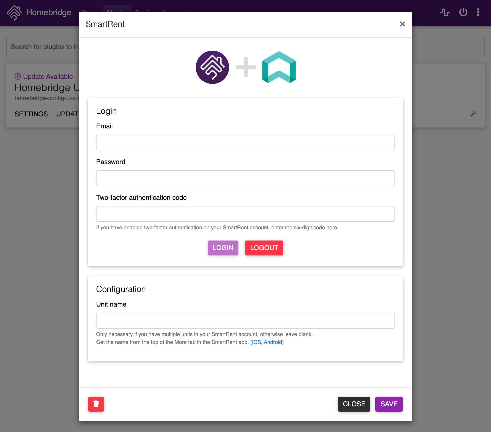

<span align="center">

<h1>
  <a href="https://github.com/Burry/homebridge-smartrent">
    
  </a>
  <br />
  Homebridge SmartRent
</h1>

[](https://www.npmjs.com/package/homebridge-smartrent)
[](https://www.npmjs.com/package/homebridge-smartrent)
[](https://github.com/Burry/homebridge-smartrent/pulls)
[](https://github.com/Burry/homebridge-smartrent/issues)

Unofficial [Homebridge](https://homebridge.io) plugin for [SmartRent](https://smartrent.com), allowing you to control your SmartRent devices with [Apple Home](https://www.apple.com/ios/home/).

</span>

## 🔄 Supported Devices

Homebridge SmartRent currently supports these devices through a SmartRent hub:

- 🔒 Locks
- 💧 Leak sensors
- 🔌 Switches

If you have another device connected to SmartRent and would like to see it supported in this plugin, please open a [device request](https://github.com/Burry/homebridge-smartrent/issues/new?assignees=&labels=enhancement,new%20device&template=feature-request.md&title=New%20device:) issue.

## ✅ Usage

## Installation

[Install Homebridge](https://github.com/homebridge/homebridge/wiki), add it to [Apple Home](https://github.com/homebridge/homebridge/blob/master/README.md#adding-homebridge-to-ios), then install and configure Homebridge SmartRent.

### Recommended

1. Open the [Homebridge UI](https://github.com/homebridge/homebridge/wiki/Install-Homebridge-on-macOS#complete-login-to-the-homebridge-ui).

2. Open the Plugins tab, search for `homebridge-smartrent`, and install the plugin.

3. Log in to SmartRent through the settings panel, and optionally set your unit name.



### Manual

1. Install the plugin using NPM:

   ```sh
   npm i -g homebridge-smartrent
   ```

2. Configure the SmartRent platform in `~/.homebridge/config.json` as shown in [`config.example.json`](./config.example.json).

3. Start Homebridge:

   ```sh
   homebridge -D
   ```

## Configuration

All configuration values are strings.

| Property   | Description                                                                                                                                              |
| ---------- | -------------------------------------------------------------------------------------------------------------------------------------------------------- |
| `email`    | SmartRent account email                                                                                                                                  |
| `password` | SmartRent account password                                                                                                                               |
| `tfaCode`  | If you have enabled two-factor authentication on your SmartRent account, enter the six-digit code here, then restart Homebridge before the code expires. |
| `unitName` | Only necessary if you have multiple units in your SmartRent account. Get the name from the top of the More tab in the SmartRent app.                     |

## 🛠 Development

### Setup Development Environment

To develop Homebridge SmartRent you must have Node.js 14 or later installed, and a modern code editor such as [VS Code](https://code.visualstudio.com/). This plugin template uses [TypeScript](https://www.typescriptlang.org/) to make development easier and comes with pre-configured settings for [VS Code](https://code.visualstudio.com/) and ESLint. If you are using VS Code install these extensions:

- [ESLint](https://marketplace.visualstudio.com/items?itemName=dbaeumer.vscode-eslint)
- [Prettier](https://marketplace.visualstudio.com/items?itemName=esbenp.prettier-vscode)
- [EditorConfig](https://marketplace.visualstudio.com/items?itemName=EditorConfig.EditorConfig)

### Install Development Dependencies

Using a terminal, navigate to the project folder and run this command to install the development dependencies:

```sh

npm install

```

### Build Plugin

TypeScript needs to be compiled into JavaScript before it can run. The following command will compile the contents of your [`src`](./src) directory and put the resulting code into the `dist` folder.

```sh

npm run build

```

### Link To Homebridge

Run this command so your global install of Homebridge can discover the plugin in your development environment:

```sh

npm link

```

You can now start Homebridge, use the `-D` flag so you can see debug log messages in your plugin:

```sh

homebridge -D

```

### Watch For Changes and Build Automatically

If you want to have your code compile automatically as you make changes, and restart Homebridge automatically between changes you can run:

```sh

npm run watch

```

This will launch an instance of Homebridge in debug mode which will restart every time you make a change to the source code. It will load the config stored in the default location under `~/.homebridge`. You may need to stop other running instances of Homebridge while using this command to prevent conflicts. You can adjust the Homebridge startup command in the [`nodemon.json`](./nodemon.json) file.

# ⚖️ Legal

## License

[Apache License, Version 2.0](https://www.apache.org/licenses/LICENSE-2.0)

[](https://app.fossa.com/projects/custom%2B9027%2Fgithub.com%2FBurry%2Fhomebridge-smartrent?ref=badge_large)

## Disclaimer

This project is not endorsed by, directly affiliated with, maintained, authorized, or sponsored by SmartRent Technologies, Inc or Apple Inc. All product and company names are the registered trademarks of their original owners. The use of any trade name or trademark is for identification and reference purposes only and does not imply any association with the trademark holder of their product brand.
